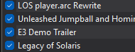

# Legacy Of Solaris ARC Rewrite
This repository is for the LOS ARC files rewrite which contains modified files from the xenon directory from LOS rewritten for expanded modding compatibility

# System
## Documentation
- [player.arc](#playerarc)
- [scripts.arc](#scriptsarc-coming-soon)
## player.arc

The player.arc file now has new folders for each playable character's lub files containing different lub files for different actions.

Note that if you want to make a mod for this, you need the [Patch.mlua](Patch.mlua) file in order to get it to work properly.

Some characters with similar proprieties (such as Rouge and Knuckles) might share the same .lub files from one of their directories. (An example would be how [rouge.lub](xenon/archives/player/xenon/player/rouge.lub) calls out [player/knuckles/knuckles-state.lub](xenon/archives/player/xenon/player/knuckles/knuckles-state.lub) for gliding and climbing parameters.)

Reefer to the [LOS player.arc Rewrite Gamebanana page](https://gamebanana.com/wips/92057) for the latest releases.

**PLEASE MAKE SURE THAT WHEN MAKING MODS USING THIS THAT YOU ALWAYS LIST WHICH VERSION OF THE MOD AND WHICH VERSION OF LOS YOU MADE THIS FOR!!**

**ALSO BE SURE TO HAVE THE MOD HIGHER THEN LOS IN THE MOD LOADER**

### Current player.arc Rewrite Version:
1.0.1 (for LOS 2025/03/25)

## scripts.arc (Coming Soon)
